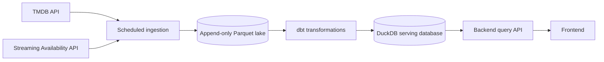
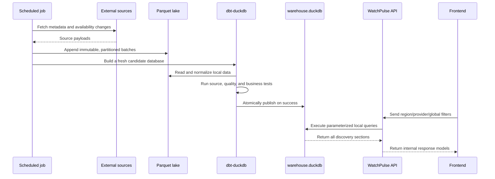

# WatchPulse Architecture

Status: active architecture baseline, aligned with `AGENTS.md` on 2026-08-17.

`AGENTS.md` defines the product requirements and is authoritative if this
document ever falls behind. This document explains how those requirements are
implemented and records the main engineering decisions.

Companion documents own the details that change at different rates:

- [Data model](data-model.md) — grains, keys, fields, and data tests;
- [Architecture decisions](decisions.md) — append-only ADR history;
- [Delivery roadmap](roadmap.md) — version scope, status, and exit criteria.

## 1. Product objective

WatchPulse answers:

> What should I watch right now, on the streaming services I have, in my
> region?

It is a streaming decision engine, not a linear TV guide or a general-purpose
catalog. The deterministic MVP supports discovery without an account and keeps
natural-language discovery and personalization as later, replaceable layers.

The four first-release discovery sections are:

- Top 10: WatchPulse's own ranking of currently available titles;
- New Releases: content whose release date is within a configurable window;
- Recently Added: content recently added to a provider in the selected region;
- Upcoming: announced future provider availability, kept separate from current
  availability.

Leaving Soon remains supported by the lifecycle model but is deferred beyond
the first public release.

New Releases and Recently Added are deliberately different business concepts.
A 1997 film added to Netflix today is Recently Added, not a New Release.

## 2. Non-negotiable boundary

External APIs are ingestion sources, never serving dependencies.



No browser interaction, filter change, or normal API request may call TMDB or
the Streaming Availability API. Availability shown to users comes exclusively
from locally persisted data.

## 3. Architecture decisions

This section summarizes the current system shape. The rationale and historical
record live in [decisions.md](decisions.md).

### DuckDB-only MVP

The MVP uses Parquet for durable raw history and DuckDB for transformation and
serving. This was chosen over a separate Postgres serving database because it
keeps local development and deployment simple at expected portfolio-scale
traffic.

The serving database is replaceable. If concurrent load or deployment
constraints outgrow DuckDB, marts can be published to Postgres without changing
the API contract, frontend, ingestion adapters, or business definitions.

### Batch rather than real-time

Daily ingestion is sufficient. Cost scales with scheduled jobs, supported
regions/providers, and upstream changes—not users, page views, or filter
interactions.

### Guest-first product

Core discovery requires no login. Region, provider, and filter preferences can
be stored in browser-local state. Authentication is introduced only when the
product needs cross-device memory, saved titles, or viewing feedback.

### Source-independent internal contracts

Source-specific payloads and provider IDs remain inside their adapters. Internal
models use `tmdb_id` as the shared external content identifier and stable keys
such as `netflix` for providers.

## 4. Component responsibilities

### Ingestion

Python clients call external sources on a schedule and write near-verbatim,
immutable Parquet batches. The layer owns authentication, pagination, retry and
rate-limit behavior, source-specific mappings, and run metrics.

TMDB supplies content identity and metadata:

- titles, descriptions, content type, release dates, runtime, and language;
- genres, images, cast, directors/creators;
- ratings, vote counts, and popularity;
- optional current provider discovery for catalog seeding and reconciliation.

The Streaming Availability API supplies lifecycle truth:

- region- and provider-scoped current availability;
- `availableSince` and expiration information;
- new, removed, updated, expiring, and upcoming changes.

The Streaming Availability changes feed is persisted because its upstream
history window may be limited.

### Transformation

dbt-duckdb reads the raw lake and builds three conceptual layers:

1. `staging`: typed and renamed source records;
2. `intermediate`: deduplication, provider crosswalks, lifecycle derivation,
   and reusable business logic;
3. `marts`: normalized dimensions/facts and an API-friendly serving catalog.

Raw response shapes never cross into the serving contract.

### Backend/query layer

The backend opens the published DuckDB database read-only. It validates filters,
uses parameterized SQL, and applies one shared filtered universe to every
discovery section.

Ranking and section definitions live outside UI components so they can evolve
independently. The backend never calls an upstream catalog API.

### Frontend

The frontend calls only the WatchPulse backend. It owns presentation, browser
preference persistence, removable filter chips, responsive title rails, and
content details. Login is not required for discovery.

## 5. Data flow



## 6. Storage and publication

### Parquet lake

The raw lake is append-only and partitioned by values such as:

```text
source / endpoint / entity_type / country / ingestion_date
```

It is the replayable system of record. Retried runs may create duplicate raw
observations; dbt deduplicates at explicit business grains. Raw history is not
deleted merely because an upstream endpoint stops returning it.

### DuckDB

`warehouse.duckdb` contains normalized models, historical facts, serving marts,
and pipeline metadata. Batch builds target a fresh temporary database. Only a
successful build with passing tests replaces the live file atomically. Failed
builds leave the last known-good database available.

## 7. Core data model

This is a structural summary. [data-model.md](data-model.md) is authoritative
for exact grains, keys, fields, invariants, and discovery date semantics.

| Model | Grain | Historical behavior |
|---|---|---|
| `dim_content` | one row per `tmdb_id` + content type | current normalized metadata |
| `content_genres` | one row per content + genre | current relationship |
| `dim_provider` | one row per stable provider key | current internal provider |
| `provider_source_map` | one row per provider + source | current source crosswalk |
| `streaming_availability` | content + region + provider + monetization type | current/upcoming state |
| `streaming_events` | one upstream/local lifecycle event | append-only |
| `title_daily_metrics` | content + observation date | append-only |
| `pipeline_runs` | one scheduled source/job run | append-only |
| `catalog_availability` | serving-friendly content/provider/region row | rebuilt from normalized data |

`streaming_availability` includes `available_since`, `available_from`,
`expires_on`, `is_available`, `is_upcoming`, source timestamps, and ingestion
timestamps. Upcoming rows must never be treated as currently available.

`streaming_events` uses stable event types such as `new`, `removed`, `updated`,
`expiring`, and `upcoming`. Events remain available after they disappear from an
upstream changes window.

The current-state table can later be complemented by derived availability
periods for removal/re-addition analysis; the append-only event table remains
the historical source of truth.

## 8. Shared query contract

All sections begin with the same validated filters:

- region;
- one or more provider keys;
- movie, series, or both;
- genre;
- maximum runtime;
- release year/range;
- minimum rating;
- language.

The backend constructs controlled predicates and bind parameters. It does not
concatenate user-provided SQL fragments.

After the shared universe is defined, section-specific rules are applied:

| Section | Availability rule | Section rule | Initial ordering |
|---|---|---|---|
| Top 10 | currently available | none | replaceable popularity score |
| New Releases | currently available | release date within `NEW_RELEASE_DAYS` | release recency, popularity |
| Recently Added | currently available | `available_since` within `RECENTLY_ADDED_DAYS` | availability recency |
| Upcoming | not currently available | future `available_from` | earliest arrival |

Thresholds come from configuration rather than UI constants.

## 9. Ranking

Ranking v1 may use TMDB popularity as its primary score. The implementation is
kept behind a ranking interface/model so later versions can combine rating,
vote confidence, release recency, availability recency, and product engagement.

Ranking must always operate after region, provider, availability, and global
filters are applied. It must never claim to be an official provider Top 10.

## 10. Ingestion behavior

- Initial region onboarding performs a bounded catalog backfill.
- Broad TMDB catalog backfills are discovery-only and reuse the metadata already
  present in discovery responses.
- Incremental jobs enrich only new, changed, or prioritized TMDB titles.
- Catalog enrichment has two explicit modes. One-time `backfill` selects titles
  with no retained metadata/provider payload. Routine `incremental` mode uses
  configurable freshness windows and a per-run title cap, deduplicates
  `(tmdb_id, content_type)` across regions and providers, and prioritizes
  upcoming, recently added, recently released, Top 10, incomplete, and popular
  titles. Planning reads only WatchPulse-owned data and supports dry runs.
- Periodic reconciliation corrects missed upstream lifecycle changes.
- HTTP clients use timeouts, conservative throttling, capped retries, and
  exponential backoff for transport errors, rate limits, and server errors.
- Secrets are injected through environment variables and never stored in raw
  request metadata or logs.
- Provider source identifiers are mapped to stable internal provider keys.
- Normal tests use fixtures or mock transports and make no live calls.

Every TMDB discovery query records upstream pages/results, fetched pages,
completion status, and whether the source's 500-page ceiling truncated it.
Incomplete queries remain usable diagnostics but must not be published as a
complete serving catalog.

The current Phase 1 implementation uses TMDB provider discovery to seed the raw
catalog. It is not the final lifecycle source and does not replace Phase 2's
Streaming Availability integration.

## 11. Testing strategy

### Unit tests

- HTTP retry and non-retry behavior;
- source adapters and malformed payload handling;
- configuration validation;
- ranking calculations;
- safe query construction.

### Data and business tests

- New Release and Recently Added remain distinct;
- removed titles are not currently available;
- upcoming titles are not currently available;
- region filters never leak another region's catalog;
- provider and runtime boundaries are correct;
- every discovery section uses the same global filters;
- historical events survive current-state changes;
- provider mappings and key relationships are valid.

A failed transformation or business test blocks database publication.

## 12. Observability and freshness

Every scheduled run records:

- run ID, source, start/end time, status, and duration;
- API request count;
- rows fetched, inserted, updated, and failed;
- error message without secrets;
- source update time, ingestion time, and last successful refresh.

The frontend may expose the last successful refresh and must not describe daily
data as real-time. CI job status and retained artifacts provide the initial
alerting/debugging path; notification integrations can be added when deployment
is selected.

## 13. Failure recovery

- Raw files are immutable and replayable.
- A failed source run is marked failed and cannot silently publish partial data.
- A failed dbt build leaves the previous database live.
- A full DuckDB rebuild can be produced from the Parquet lake.
- Reconciliation jobs repair lifecycle gaps without deleting event history.

## 14. Security and cost controls

- External API keys exist only in backend jobs and secret stores.
- The serving connection is read-only.
- API inputs are validated and SQL is parameterized.
- Logs exclude credentials and raw authorization headers.
- Public endpoints receive appropriate request limits before deployment.
- No PII is required for the guest MVP.

If natural-language discovery is introduced, all model calls go through the
backend with configurable prompt limits, per-session/user limits, daily spend
caps, usage records, unsupported-intent handling, and a kill switch. The LLM
extracts intent; it never invents provider availability.

## 15. Multi-region and scaling path

Region is present in availability, lifecycle events, serving data, and queries.
Adding a country is therefore an additive configuration/backfill operation, not
a schema redesign. Provider choices are region-aware and source mappings may
differ by region without changing frontend keys.

DuckDB is appropriate while traffic is modest and publication can use an atomic
file swap. If serving concurrency becomes a measured problem, publish the same
serving marts to Postgres and retain Parquet/DuckDB for ingestion and analytics.
Avoid introducing distributed systems before usage demonstrates a need.

## 16. Repository boundaries

```text
watchpulse/               shared configuration and internal domain models
ingestion/                scheduled source clients, adapters, raw writes
warehouse/                dbt-duckdb staging, intermediate, and marts
api/                      read-only database access and parameterized queries
frontend/                 presentation and browser-local guest preferences
.github/workflows/        tests, scheduled ingestion, build, publication
docs/                     architecture and engineering decisions
scripts/                  safe local/build/publication operations
tests/                    cross-component and end-to-end tests
```

Dependencies point inward toward internal contracts. The frontend does not read
DuckDB directly, the API does not read raw source payloads, transformations do
not call external APIs, and ingestion does not contain serving queries.

## 17. Implementation phases

This is the high-level sequence. Version status, detailed scope, and exit
criteria live in [roadmap.md](roadmap.md).

1. **Foundation:** repository structure, configuration, DuckDB setup, TMDB
   client, internal models, tests, and ingestion run metadata.
2. **Streaming availability:** Streaming Availability client, provider
   mappings, region-aware current state, daily changes, and historical events.
3. **dbt and serving data:** staging models, normalized dimensions/facts,
   `catalog_availability`, freshness checks, and business tests.
4. **Backend and frontend discovery:** safe shared filters, Top 10, New
   Releases, Recently Added, Leaving Soon, Upcoming, content details, and a
   polished responsive UI without mandatory login.
5. **Deployment:** atomic database publication, scheduled jobs, CI checks,
   monitoring, documentation, and a live URL.
6. **Natural-language discovery:** bounded intent extraction mapped onto the
   same local query contract, usage tracking, cost controls, and kill switch.
7. **Personalization:** optional authentication, saved/watched feedback, and a
   replaceable New For You ranking layer.

## 18. Deferred decisions

When one of these is resolved, record it as a new ADR in
[decisions.md](decisions.md) and update the roadmap version it affects.

- Which Streaming Availability API plan/endpoints provide the required region,
  expiration, changes, and upcoming coverage at acceptable cost.
- Which frontend framework best supports the desired production-looking UI;
  the API boundary does not depend on this choice.
- Which hosting provider supplies the live DuckDB file and atomic deployment.
- The measured DuckDB size/concurrency threshold that justifies Postgres.

These choices do not block completion of the remaining local Phase 1 work.
