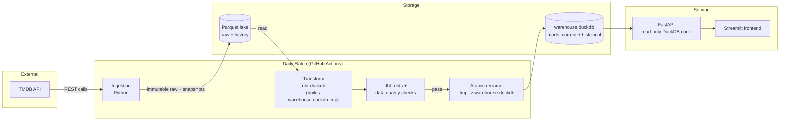

# WatchPulse — Architecture Proposal

Status: **Draft for review — do not implement yet.**
Scope: Architecture only, per `AGENTS.md`. This document analyzes the product requirements, makes explicit assumptions, compares architecture options, and recommends one design for the MVP.

---

## 1. Problem Statement

Users who subscribe to multiple streaming services (Netflix, Disney+, Prime Video, etc.) have no good way to answer:

> "What are the best new releases available to me this week, on the services I already pay for, in my country?"

Existing catalog browsers (JustWatch-style) show *everything*, unranked and un-curated. WatchPulse's job is curated, explainable, country- and provider-aware discovery of what's new and worth watching — not a full catalog browser.

The system must also behave like a real data product: it should retain history (not just current state), compute its own ranking rather than parroting a vendor's rating, and be built so a single developer can run it cheaply while leaving room to grow into a real public product across more countries and sources.

---

## 2. Product Scope

**In scope for the architecture (not all for MVP code):**

- Country-aware, provider-aware discovery of new/trending/must-watch content.
- Movies and TV shows (with seasons/episodes as a defined future extension, not required for MVP).
- Explainable, versioned, self-computed ranking.
- Historical tracking of availability, popularity, and ranking over time.
- A pluggable source model, starting with TMDB, designed to admit more sources later.
- A path from single-country (Greece) to multi-country without a data-model rewrite.

**Explicitly out of scope for MVP** (see Non-Goals).

---

## 3. Assumptions

`AGENTS.md` leaves several domain and delivery decisions open. Rather than blocking on them, the following reasonable assumptions are made and used throughout this document. Each one that materially affects the design is repeated in [Decisions Needed Before Implementation](#20-decisions-needed-before-implementation) so it can be confirmed or overridden before coding starts.

1. **Initial provider set**: Netflix, Disney+, Amazon Prime Video, Apple TV+ — TMDB's `watch/providers` data for Greece. HBO Max/Skyshowtime excluded initially only because they have inconsistent TMDB coverage in GR at the time of writing; the provider list is config, not schema, so this is cheap to change.
2. **"New this week"** is defined primarily by **first-observed subscription availability in-country** (our own snapshot history), not TMDB's global `release_date`. A 2019 movie that just landed on Netflix Greece this week counts as "new" for discovery purposes. TMDB release/premiere dates are retained separately as a distinct concept (see [Release](#63-release)) and used for "must-watch new productions" style framing, not as the sole trigger for "new this week."
3. **Subscription-first**: MVP ranks and surfaces `subscription` and `free`/`ads` availability. `rent`/`buy` availability is ingested and stored (it's cheap and needed to avoid the "rental shown as subscription" data-quality failure called out in `AGENTS.md`) but is filtered out of the default MVP UI.
4. **TV granularity**: MVP tracks TV shows as a whole title with a `latest_season_available` / `new_episodes_this_week` signal derived from TMDB's season/episode metadata, but does not model individual episodes as first-class fact rows yet. Full season/episode-grain facts are a defined, additive extension (new fact tables, no changes to existing grains).
5. **Ranking is a batch, deterministic, rules-based score** (weighted combination of normalized rating, vote confidence, popularity momentum, recency, release relevance), computed weekly per country, explainable via stored component scores — not an ML model.
6. **No user accounts in MVP.** "Providers I subscribe to" is a client-side/query-param selection (e.g., `?country=GR&providers=netflix,disney`), not a stored user profile. This satisfies the product UX ("select your providers") without pulling authentication into MVP scope.
7. **Single-region deployment** (EU) is fine for MVP; no multi-region serving requirement yet.
8. **Budget**: effectively $0–5/month. Every default choice favors a generous free tier over a "correct-looking" paid managed service.

---

## 4. Non-Goals (MVP)

- User authentication, accounts, or saved watchlists.
- Personalized (per-user) recommendations or ML-based ranking.
- Payments or any monetization.
- Real-time/streaming ingestion (daily batch is sufficient — TMDB data doesn't change faster than that in ways that matter to weekly discovery).
- Episode-level granularity.
- Multi-region active-active serving.
- Non-TMDB sources (the abstraction is designed now; the second source is not built now).

---

## 5. Domain Model

### 5.1 Title

A movie or TV show. Modeled as a supertype/subtype: `dim_title` holds fields common to both (name, TMDB id, popularity, vote stats, genres, poster), and `dim_movie` / `dim_tv_show` hold type-specific attributes (runtime vs. episode/season counts, etc.). This avoids nullable-everything single-table modeling while keeping a single join point (`title_id`) for availability, release, and ranking facts. Seasons/episodes are a future subtype keyed by `title_id` + season/episode number — deferred, not precluded.

### 5.2 Provider

A streaming service (Netflix, Disney+, ...), identified by our own stable `provider_id`, mapped to TMDB's `provider_id` per source. Source-mapping is a separate crosswalk table (`dim_provider_source_map`) so a future non-TMDB source can reuse the same provider dimension instead of forcing a re-key.

### 5.3 Country / Market

ISO 3166-1 alpha-2 code as the natural key (`GR`, `GB`, `DE`, `US`, ...) wrapped in `dim_country` so display name, region grouping, and "is this market currently supported by the product" flag live in one place. Every availability, release, and ranking fact carries `country_id`.

### 5.4 Streaming Availability

The core, highest-cardinality relationship: `title × provider × country × availability_type`, observed at a point in time. Because "when did this change" is a first-class product question, this is modeled with two layers (see [Historical Tracking](#13-historical-tracking--section-9-in-source-order) for full rationale):

- **`fct_streaming_availability_snapshot`** — append-only, one row per `(title, provider, country, availability_type, observed_date)` every day the ingestion runs. This is the raw truth.
- **`fct_availability_period`** — derived (SCD2-style) contiguous windows: `(title, provider, country, availability_type, valid_from, valid_to)`, `valid_to = null` while still available. Directly answers "was it removed and re-added," "how long was it available."

Availability types: `subscription`, `free`, `ads`, `rent`, `buy` — an enumerated, tested dimension (`dim_availability_type`), not a free-text string, specifically to catch the "rental shown as subscription" failure mode called out in the requirements.

### 5.5 Release

A content release **event**, not a single date on the title. Modeled as `fct_release`: one row per `(title, release_type, country?)`, where `release_type ∈ {original_premiere, theatrical, digital, streaming_availability, season_release, episode_air}`. Country is nullable because some release types (original premiere) are global while others (theatrical, digital) are market-specific. "New this week" (per Assumption 2) is computed primarily from `fct_availability_period.valid_from`, cross-referenced with `fct_release` for context/explanation ("newly available, originally released 2019").

### 5.6 Ranking / Recommendation

A **versioned, explainable, batch-computed score**, not a live query-time sort. `fct_ranking` stores one row per `(ranking_run_id, week, country, title_id)` with the final score, category label (`must_watch` / `worth_watching` / `trending` / `hidden_gem`), and a JSON/struct column of the individual component scores that produced it (so "why is this ranked #1" is answerable from stored data, not recomputation). `ranking_run_id` ties back to a `dim_ranking_version` table recording the scoring formula/weights used — a real, if simple, model registry.

---

## 6. Architecture Options Considered

Three viable options, evaluated against the stated priority order (correct data model → useful product → maintainability → low cost → simplicity → history → extensibility → performance → scale).

### Option A — DuckDB/Parquet all the way (embedded analytics engine as both transform and serving store)

Ingestion writes Parquet to object storage. `dbt-duckdb` transforms in place. The API (FastAPI) opens the same DuckDB file/Parquet directory read-only to serve queries directly. No separate database.

- ✅ Simplest possible stack, zero database to operate, free.
- ✅ Excellent for analytics-shaped queries (rankings, historical aggregates).
- ❌ DuckDB is single-writer / not built for concurrent low-latency public API traffic; serving directly from the file that a nightly batch job also rewrites is operationally awkward (need to swap files atomically, handle concurrent readers during a rebuild). **Mitigation adopted (see §7):** the daily build writes to a fresh `warehouse.duckdb.tmp`, and only an atomic rename to `warehouse.duckdb` on success makes it live; the API always opens the current file read-only and never touches the in-progress build.
- ❌ No natural path to "real" multi-user public API without bolting on a database anyway. Acceptable at MVP traffic levels; revisit (Option C) if/when concurrent read load or write contention becomes real.

### Option B — PostgreSQL end-to-end (transform and serve from one relational database)

Ingestion lands raw JSON in Postgres (`jsonb` staging tables). `dbt-postgres` transforms in-database. FastAPI serves directly from Postgres.

- ✅ One system to operate; mature hosting free tiers exist (Supabase, Neon, Railway).
- ✅ Natural fit for serving a public API (proper concurrency, indexing, connection pooling).
- ❌ Postgres is a weaker fit for exploratory/local analytics engineering work (no first-class Parquet/columnar story, slower for the kind of ad-hoc historical analysis this project explicitly wants to showcase).
- ❌ Free-tier Postgres storage/compute limits are the tightest constraint if raw+snapshot history grows (JSON blobs from TMDB are not tiny).

### Option C — Hybrid: DuckDB/Parquet for ingestion + transformation, Postgres for serving (recommended)

Raw and historical data lives as Parquet in object storage (cheap, durable, infinitely queryable with DuckDB locally). `dbt-duckdb` builds staging → marts entirely in DuckDB against that Parquet lake. A final, small **publish** step loads only the *serving-relevant* marts (current week's rankings, current availability, dimension tables) into a lightweight Postgres instance that the API reads from. History and raw data stay in the Parquet lake; Postgres only ever holds what the product needs to serve *now*, kept small and fast on purpose.

- ✅ Best fit for both halves of the job: DuckDB/Parquet is the right tool for a data/analytics engineering showcase (cheap, local-dev-friendly, great for history); Postgres is the right tool for serving a public API.
- ✅ Clean separation of concerns: analytics engine failures never affect API uptime; API load never competes with batch transform load.
- ✅ Stays cheap — Postgres only holds a small "current state" slice, so free tiers comfortably last much longer than Option B.
- ⚠️ One more moving part than A or B (an explicit publish/export step) — mitigated by keeping that step to "load N marts into M tables," not a second transformation layer.

### Comparison

| Criterion | A: DuckDB-only | B: Postgres-only | C: Hybrid (recommended) |
|---|---|---|---|
| Correct data model support | Good | Good | Good |
| Serving a public API well | Poor | Good | Good |
| Analytics/history workload fit | Excellent | Fair | Excellent |
| Operational simplicity | Best | Good | Good (one extra step) |
| Cost | Free | Free tier gets tight over time | Free, stays free longer |
| Local dev experience | Excellent | Good (needs local PG) | Excellent (DuckDB local, PG optional locally) |

**Recommendation: Option C** for the reasons above. **Decision (2026-08-16): Option A selected instead** — the project owner prioritized operational simplicity (one system, nothing to host/pay for) over the serving-scalability headroom Option C buys, given MVP traffic is expected to be very low. The atomic-file-swap mitigation above removes the main correctness risk; Postgres remains the documented upgrade path (§23) if/when public traffic outgrows a single DuckDB file. All sections below describe **Option A** as built.

---

## 7. Recommended Architecture

- **Ingestion**: Python scripts calling the TMDB API, writing immutable raw JSON/Parquet to the local (later object-storage-backed) lake, partitioned by `country/entity_type/date`.
- **Storage (history/analytics + serving, single tier)**: Parquet files as the durable, append-only system of record, plus one DuckDB database file (`warehouse.duckdb`) that is both the dbt build target and the thing the API queries directly. No separate serving database.
- **Transformation**: `dbt-duckdb`, reading the Parquet lake, building staging → intermediate → marts models, run in GitHub Actions.
- **Atomic publish**: the daily build runs entirely against `warehouse.duckdb.tmp`; only on a clean `dbt build` + passing tests does the workflow atomically rename it to `warehouse.duckdb`, which is the file the API has open read-only. The API is never pointed at a file mid-build, and a failed build simply leaves yesterday's file live.
- **Orchestration**: GitHub Actions scheduled workflow (daily cron): ingest → dbt build/test (against `.tmp`) → atomic swap → notify on failure.
- **Serving**: FastAPI, read-only DuckDB connection against `warehouse.duckdb`.
- **Frontend**: Streamlit for the MVP demo, consuming the API (not DuckDB directly).
- **Deployment**: API + its `warehouse.duckdb` file deployed together on a single free/cheap PaaS instance (Fly.io/Render) with a persistent volume; Streamlit on Streamlit Community Cloud, calling the API over HTTP; batch runs entirely inside GitHub Actions and pushes the refreshed `warehouse.duckdb` to that volume (e.g., via the PaaS's deploy/artifact mechanism or a small sync step) — no server needs to stay up for batch itself.

---

## 8. System Diagram



---

## 9. Data Flow

```mermaid
sequenceDiagram
    participant CRON as GitHub Actions (daily)
    participant ING as Ingestion
    participant TMDB as TMDB API
    participant LAKE as Parquet Lake
    participant DBT as dbt-duckdb
    participant DB as warehouse.duckdb
    participant API as FastAPI
    participant USER as User/Frontend

    CRON->>ING: trigger daily run
    ING->>TMDB: discover/changes + watch/providers (per country)
    TMDB-->>ING: JSON responses
    ING->>LAKE: write raw + snapshot Parquet (append-only, dated partitions)
    CRON->>DBT: dbt build (target: warehouse.duckdb.tmp)
    DBT->>LAKE: read raw/staging, write marts (facts/dims)
    DBT->>DBT: run dbt tests (source, transform, business-rule)
    DBT-->>CRON: fail fast if tests fail (no swap; yesterday's file stays live)
    CRON->>DB: atomic rename .tmp -> warehouse.duckdb
    USER->>API: GET /weekly?country=GR&providers=netflix,disney
    API->>DB: query marts (read-only connection)
    DB-->>API: rows
    API-->>USER: ranked, explainable results
```

---

## 10. Storage Model

Single engine, two artifacts, each with a clear job:

**Parquet lake (system of record, append-only)**
- Raw layer: near-verbatim TMDB API responses, one file per ingestion run, never overwritten. Enables full replay/reprocessing if transformation logic changes.
- Staging/snapshot layer: normalized, typed, one row per observed entity per day (`fct_streaming_availability_snapshot`, `fct_title_daily_metrics` inputs).
- Partitioning: `country=/entity_type=/date=` — this is exactly what makes multi-country expansion additive rather than a redesign.
- Lives on disk locally / a persistent volume in deployment; can move to real object storage (R2/S3) later without any model changes, since dbt-duckdb reads Parquet by path either way.

**`warehouse.duckdb` (marts + serving, current + historical in one file)**
- The dbt build target: staging → intermediate → marts, including the full historical facts (`fct_availability_period`, `fct_title_daily_metrics`, `fct_ranking` — all runs, not just latest). Nothing is dropped to keep this file "current-state only"; DuckDB handles this scale of historical data comfortably in a single file.
- Also the file the API opens read-only to serve queries — no separate publish/export step, no second copy of the data to keep in sync.
- Reconstructable from scratch from the Parquet lake at any time (`dbt build --full-refresh`), so the file itself never needs its own backup strategy beyond the lake.
- Concurrency is handled by the atomic build-then-rename pattern in §7, not by DuckDB's own concurrency model — the API only ever holds a read-only handle on a file that batch never writes to in place.

---

## 11. Ingestion Design

- **Language/runtime**: Python, scheduled via GitHub Actions cron (daily).
- **Endpoints used**: `discover/movie`, `discover/tv` (initial backfill, paginated, filtered by `watch_region=GR`), `movie/changes` / `tv/changes` (daily incremental — only re-pull entities that actually changed), `{movie|tv}/{id}/watch/providers` (availability per country), `{movie|tv}/{id}` (title metadata).
- **Idempotency**: every write is `(entity_id, source, ingested_at)`-keyed and append-only; re-running a day's ingestion twice produces duplicate-but-identical snapshot rows, which downstream dbt models deduplicate on `(entity_id, provider, country, date)` — safe to retry freely.
- **Incremental strategy**: full backfill once per country on onboarding; daily incremental thereafter driven by TMDB's `changes` endpoints, with a full re-sync of `watch/providers` for all previously-seen titles at a lower frequency (e.g., weekly) as a correctness safety net, since provider availability changes aren't always reflected in the `changes` feed.
- **Rate limiting/retries**: conservative client-side throttling well under TMDB's documented limits, exponential backoff with jitter on 429/5xx, capped retry count, and a hard run-time budget so a stuck run fails loudly instead of hanging GitHub Actions.
- **Schema evolution**: raw layer stores the API response close to verbatim (JSON columns/Parquet with a `raw` struct) so an unexpected new TMDB field never breaks ingestion — it just isn't modeled downstream until a dbt change picks it up.
- **Source abstraction**: an `IngestionSource` interface (`fetch_titles`, `fetch_availability`, `fetch_changes`) with a `TMDBSource` implementation now; a second source later (e.g., editorial curation) implements the same interface and lands in the same raw-layer shape, keyed by its own `source` id, without touching existing TMDB data.

---

## 12. Transformation / dbt Design

- **Engine**: `dbt-duckdb`, run against the Parquet lake (DuckDB can query Parquet directly via `external` sources — no data copy needed to start transforming).
- **Layering**: `staging` (1:1 with raw, typed/renamed) → `intermediate` (deduplication, SCD2 derivation for availability periods, join logic) → `marts` (final dims/facts documented below).
- **Ranking logic** lives in a dedicated intermediate/marts model set (`int_ranking_components` → `fct_ranking`), with weights/formula version-controlled in a dbt seed or vars file — this satisfies "ranking logic should be stored and versioned in the analytics layer."
- **Update strategy**: snapshot-grain models are `insert`/`append` (dbt incremental models keyed by the day partition); SCD2/period models use dbt's `snapshot` feature or an equivalent incremental merge; ranking is fully recomputed per week (not incremental) since it's a from-scratch weekly batch by design.

### Core models

| Model | Grain | Primary Key | Key Dimensions | Measures | Update Strategy | History |
|---|---|---|---|---|---|---|
| `dim_title` | one row per title | `title_id` | type (movie/tv), genre(s) | vote_average, vote_count, popularity (latest) | full refresh (small dim) | current-state only; changes tracked via `fct_title_daily_metrics` |
| `dim_movie` / `dim_tv_show` | one row per title (subtype) | `title_id` | runtime / season_count | — | full refresh | current-state only |
| `dim_provider` | one row per provider | `provider_id` | name, logo | — | full refresh | current-state only |
| `dim_country` | one row per country | `country_id` (ISO2) | region, is_supported | — | full refresh | current-state only |
| `dim_genre` | one row per genre | `genre_id` | name | — | full refresh | current-state only |
| `fct_streaming_availability_snapshot` | title × provider × country × availability_type × observed_date | composite | — | is_present (1) | incremental append | append-only, daily |
| `fct_availability_period` | title × provider × country × availability_type × valid_from | composite | valid_to (nullable = currently available) | days_available (derived) | incremental merge (SCD2) | slowly changing, full window history |
| `fct_release` | title × release_type × country (nullable) | composite | release_type enum | release_date | append/upsert on new info | append-only (a release event doesn't change once known) |
| `fct_title_daily_metrics` | title × country × date | composite | — | popularity, vote_average, vote_count, popularity_delta | incremental append | append-only, daily |
| `fct_ranking` | ranking_run_id × country × title_id | composite | category (must_watch/worth_watching/trending/hidden_gem) | final_score, component_scores (struct) | full recompute per run | append-only across runs (never overwrite prior week's ranking) |
| `fct_provider_catalog_snapshot` | provider × country × date | composite | — | title_count | incremental append | append-only, daily (cheap QA/trend signal, e.g. "provider added most content this month") |

Marts on top (`mart_weekly_releases`, `mart_must_watch`, `mart_trending`, `mart_hidden_gems`, `mart_provider_weekly_summary`) are thin, denormalized, API-shaped views over the facts/dims above — they carry no independent history, they're just serving-friendly projections, which is exactly what gets published to Postgres.

---

## 13. Historical Tracking

Three explicit tiers, matching the requirement to state what's append-only vs. snapshot vs. SCD vs. current-state-only:

- **Append-only**: raw ingestion files; `fct_streaming_availability_snapshot`; `fct_title_daily_metrics`; `fct_release`; `fct_ranking` (each run is a new set of rows, prior runs are never touched — this is what makes "what was #1 last Friday" answerable).
- **Slowly changing (SCD2)**: `fct_availability_period` — derived from the snapshot fact, gives clean "added/removed/re-added" windows without scanning raw snapshots at query time.
- **Current-state only**: dimension tables (`dim_title`, `dim_provider`, `dim_country`, `dim_genre`) — attributes like a title's current vote average don't need their own history because `fct_title_daily_metrics` already tracks that trend at the correct grain.

This directly answers the example questions in `AGENTS.md`: "first available" and "removed/re-added" → `fct_availability_period`; "added this week" → `fct_availability_period.valid_from` this week; "popularity evolution" → `fct_title_daily_metrics` time series; "ranked #1 last Friday" → `fct_ranking` filtered to that `ranking_run_id`.

---

## 14. Ranking Design

Deterministic, weighted, explainable — computed weekly per country in dbt:

```
score = w1 * normalized_rating          (Bayesian-adjusted vote_average, corrects the "10.0 from 3 votes" failure)
      + w2 * vote_confidence            (log-scaled vote_count)
      + w3 * popularity_momentum        (Δ popularity from fct_title_daily_metrics)
      + w4 * recency                    (decay function on availability valid_from / release relevance)
      + w5 * genre_weighting            (small, optional adjustment)
```

- Weights (`w1..w5`) live in a version-controlled dbt vars/seed file; each ranking run records which version produced it (`dim_ranking_version`).
- Category thresholds (`must_watch` / `worth_watching` / `trending` / `hidden_gem`) are simple, documented cutoffs on the score + component signals (e.g., `hidden_gem` = high `normalized_rating` but low `popularity`), not a separate model.
- A dbt test enforces `fct_ranking` only ever contains titles with a currently-open `fct_availability_period` row (`valid_to IS NULL`) at the relevant country/provider — directly preventing "ranking output containing unavailable content."

---

## 15. Serving / API Layer

- FastAPI, stateless, read-only against `warehouse.duckdb` (a single read-only DuckDB connection/pool held open by the API process; the Parquet lake itself is never touched in the request path — keeps serving fast and decoupled from batch).
- Primary endpoints: `GET /weekly`, `GET /must-watch`, `GET /trending`, `GET /hidden-gems`, `GET /providers/{provider}/new`, `GET /titles/{id}` — each accepting `country` and `providers` query params, matching the "select country + providers" UX.
- Every ranked response includes the component scores that produced it, satisfying "explain why something is recommended" at the API contract level, not just in the UI.
- Versioned via URL prefix (`/v1/...`) from day one, since this is meant to evolve into a public API.

---

## 16. Frontend Boundary

- Frontend talks to the API only — no direct database access, ever. This is the boundary that lets frontend technology change freely (Streamlit for the MVP demo now, a richer frontend later if warranted) without touching ingestion/transformation/serving.
- MVP frontend responsibility: country + provider selection (client-side/query-string state, no backend user profile needed per Assumption 6), and rendering the curated sections from `AGENTS.md`'s example MVP output.

---

## 17. Testing

Three explicit categories, run as part of the daily `dbt build` before publish:

- **Source checks** (on raw/staging): not-null critical identifiers, valid country codes, no impossible dates (future `observed_date`, release dates before 1900), TMDB ID uniqueness.
- **Transformation checks** (on intermediate/marts): no duplicate `(title, provider, country, date)` availability rows, referential integrity (every availability/ranking row has a valid `title_id`), `fct_availability_period` windows never overlap for the same key, no unknown `availability_type` values.
- **Business-rule checks**: `rent`/`buy` never appears where the product treats something as subscription-available; `fct_ranking` rows always reference a currently-available title (see §14); no sudden >X% drop in ingested title count day-over-day (stale/broken ingestion guard); ranking scores fall within expected bounds.

A failing test blocks the atomic swap (§7) — `warehouse.duckdb` only ever reflects a dataset that passed tests, so the API never serves known-bad data; a failed build just leaves yesterday's file live.

---

## 18. Observability

Kept intentionally lightweight for MVP, with an explicit evolution path:

- GitHub Actions run status is the primary signal; failure triggers a notification (GitHub's built-in email, or a Slack/Discord webhook step).
- dbt's own artifacts (`run_results.json`, test results) are uploaded as workflow artifacts for post-hoc debugging.
- A small `meta_ingestion_run` table (row counts, duration, per-source success/failure) is written by ingestion itself — cheap, queryable "did today's run look normal" history, and the input to the "unexpected drop in ingested titles" business-rule test.
- dbt source freshness checks flag stale upstream data (e.g., ingestion silently stopped running).
- Evolution path if this grows: swap the webhook notification for a real alerting tool, and/or adopt a workflow orchestrator (Dagster/Prefect) with built-in lineage/observability UI — not needed at MVP scale.

---

## 19. Failure Recovery

- Raw layer immutability means any day can be safely reprocessed: re-run ingestion for a given date (idempotent, see §11) and re-run `dbt build` — no manual cleanup required.
- `dbt build --full-refresh` is the escape hatch for a broken incremental model.
- The atomic swap (§7) only runs after tests pass, so a bad batch never reaches the live `warehouse.duckdb`; the file can always be fully rebuilt from the Parquet lake if it's ever corrupted or needs a schema change (it holds no data that doesn't already live durably in the lake).
- TMDB API outages/rate-limit exhaustion cause the ingestion step to fail loudly (capped retries) rather than silently ingesting partial data; the prior day's `warehouse.duckdb` remains live until the next successful run (no partial swap).

---

## 20. Deployment

- **Local dev**: everything runs on a laptop — DuckDB against local Parquet files, no cloud dependency required to iterate on dbt models, ingestion, or API code.
- **Batch (ingestion + transform + atomic swap)**: GitHub Actions scheduled workflow — no server to keep running, free for a repo at this scale. The refreshed `warehouse.duckdb` is published as a workflow artifact and synced to the API's persistent volume (or, simplest for MVP, the API redeploys picking up a freshly-built file from the same workflow) as the last step.
- **API**: containerized FastAPI on a free/low-cost PaaS (Fly.io or Render free tier) with a persistent volume holding `warehouse.duckdb`.
- **Frontend**: Streamlit Community Cloud, calling the deployed API over HTTP.
- **Object storage**: local disk / the API's persistent volume for MVP; the Parquet lake path is abstracted so it can move to real object storage (Cloudflare R2) later without model changes, if/when history size or durability needs outgrow a single volume.

---

## 21. Cost Considerations

Every component above has a free tier sufficient for this workload's scale (single-digit GB of Parquet per year for Greece, low request volume on the API). The only genuine future cost driver is Parquet lake size as history and country count grow — mitigated by Parquet's columnar compression and the fact that raw JSON is the only large layer (marts are tiny by comparison). No paid dependency is required to run WatchPulse at MVP or early-growth scale; the only thing to watch is persistent volume size on the PaaS free tier as `warehouse.duckdb` grows with history.

---

## 22. Security Considerations

- TMDB API key stored as a GitHub Actions secret in CI, `.env` (gitignored) locally — never committed.
- The API process holds a **read-only** DuckDB connection to `warehouse.duckdb`; only the batch workflow (via its own isolated build-then-swap step) ever writes to it.
- No PII is collected in MVP (no accounts) — country/provider selection is stateless query params, not stored user data — which meaningfully simplifies the security/privacy surface for now.
- Outbound calls to TMDB respect documented rate limits/ToS; API responses are cached in the Parquet lake specifically to minimize redundant calls.
- API is public-read but rate-limited at the edge (PaaS/CDN level) to prevent abuse once it's public-facing.

---

## 23. Scaling Strategy (Greece → Multi-Country)

The data model already carries `country_id` on every fact table and partitions the Parquet lake by country, so adding a market is additive, not a redesign:

1. Add the country to `dim_country` (`is_supported = true`) and the ingestion config list.
2. Run an initial backfill for that country (same ingestion code, new `watch_region` parameter).
3. dbt models require no changes — every fact is already country-grained.
4. Ranking weights *can* optionally be tuned per-country later (via `dim_ranking_version` scoped by country) but default to shared weights initially.
5. The next `dbt build` naturally includes the new country's marts in `warehouse.duckdb` — no separate publish step to update.

Beyond multi-country, the same reasoning applies to multi-source (§11's `IngestionSource` abstraction) and to season/episode granularity (additive fact tables keyed by the existing `title_id`). If concurrent API load or write contention ever becomes a real constraint on the single-DuckDB-file approach, Option C (§6) — splitting out a Postgres serving layer — is the documented upgrade path; nothing in the domain model needs to change to make that move.

---

## 24. Repository Structure

```
watchpulse/
├── AGENTS.md
├── docs/
│   └── architecture.md
├── data/
│   └── lake/                   # Parquet lake (gitignored; local stand-in for object storage)
├── ingestion/
│   ├── sources/
│   │   └── tmdb/               # TMDBSource implementation
│   ├── core/                   # IngestionSource interface, retry/rate-limit utils
│   └── tests/
├── warehouse/                   # dbt project (dbt-duckdb)
│   ├── models/
│   │   ├── staging/
│   │   ├── intermediate/
│   │   └── marts/
│   ├── seeds/                   # ranking weights, static reference data
│   ├── snapshots/
│   └── tests/
├── api/                          # FastAPI app (read-only against warehouse.duckdb)
│   ├── routers/
│   └── tests/
├── frontend/
│   └── streamlit_app/            # Streamlit MVP demo, calls the API only
├── infra/
│   └── github-actions/           # (or .github/workflows directly) — ingest, build, swap
└── tests/                        # cross-cutting/integration tests
```

Ownership boundaries: `ingestion` never talks to the warehouse directly (it only ever writes Parquet to `data/lake/`); `warehouse` never calls TMDB or the API — it only reads the lake and writes `warehouse.duckdb`; `api` holds a read-only connection to `warehouse.duckdb` and never writes to it or touches the Parquet lake; `frontend` never talks to DuckDB/Parquet directly, only the API. Each boundary is enforceable by simply not installing the other layer's dependencies in that component.

---

## 25. MVP Implementation Phases

0. **This document reviewed and decisions below confirmed.**
1. Repo scaffolding + TMDB ingestion for Greece → raw Parquet lake.
2. Core dbt staging models + `dim_title`/`dim_provider`/`dim_country` + `fct_streaming_availability_snapshot`, with source/transformation tests.
3. `fct_availability_period` (SCD2) + `fct_release` + `fct_title_daily_metrics`.
4. Ranking v1 (`fct_ranking`) + business-rule tests.
5. Atomic build-then-swap wiring (`warehouse.duckdb.tmp` → `warehouse.duckdb`) as a reusable script/CI step.
6. FastAPI read endpoints against `warehouse.duckdb`.
7. Streamlit MVP frontend.
8. GitHub Actions daily orchestration + basic observability (`meta_ingestion_run`, failure notifications).
9. Smoke-test multi-country readiness by onboarding a second country end-to-end.

---

## 26. Open Questions

- Exact TMDB coverage check for Apple TV+ in GR before Phase 1 backfill (kept in launch scope per decision below; verify data completeness once ingestion is live).
- At what `warehouse.duckdb` file size / API request volume it's worth revisiting Option C (Postgres serving layer) — no hard trigger defined yet, revisit if it comes up.
- Where the persistent volume for `warehouse.duckdb` lives once deployed (depends on final PaaS choice for the API) — a Phase 6 detail, not a blocker for Phases 1–5 which are local-dev only.

---

## 27. Decisions Needed Before Implementation

All resolved as of 2026-08-16:

1. ~~Confirm "new this week" definition~~ — **Confirmed**: first-observed in-country subscription availability (Assumption 2, unchanged).
2. ~~Confirm initial provider list~~ — **Confirmed**: Netflix, Disney+, Prime Video, Apple TV+ (Assumption 1, unchanged).
3. ~~Confirm subscription-first MVP scope~~ — **Confirmed**: rent/buy tracked but hidden from default UI (Assumption 3, unchanged).
4. ~~Confirm no user accounts in MVP~~ — **Confirmed**: provider selection stays client-side/stateless (Assumption 6, unchanged).
5. ~~Confirm storage architecture~~ — **Decided: Option A (DuckDB-only)**, not the recommended Option C hybrid — see §6 decision note and the atomic build-then-swap mitigation in §7/§10.
6. ~~Pick concrete vendors~~ — **No longer applicable to Phases 1–5**: no object storage or Postgres vendor needed now that Option A is selected; only a deployment-time PaaS choice remains (§26).
7. ~~Confirm MVP frontend~~ — **Confirmed: Streamlit.**
8. ~~Confirm TV granularity assumption~~ — **Confirmed**: whole-title tracking with a new-episode signal, no episode-grain facts yet (Assumption 4, unchanged).

Implementation may proceed. Phase 1 (repo scaffolding + TMDB ingestion for Greece) starts next per §25.
