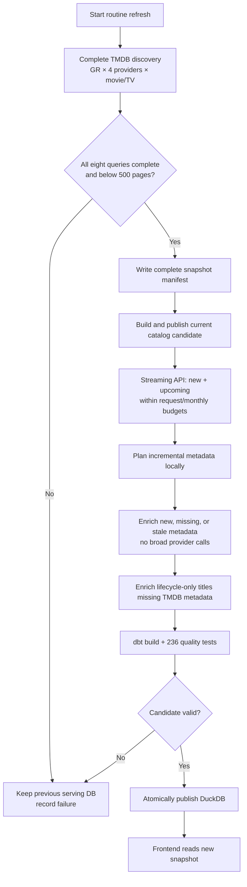
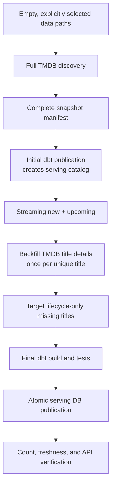
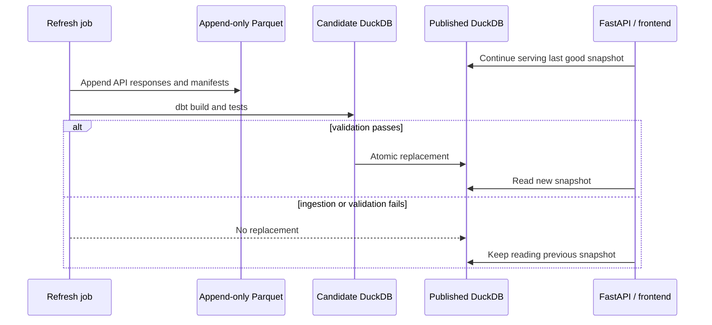

# WatchPulse catalog refresh runbook

This runbook defines the supported operational flows for Greece and the four
configured subscription providers: Netflix, Disney+, Prime Video, and Apple
TV+. External APIs are ingestion sources only. The frontend and FastAPI always
query the last successfully published DuckDB.

## Data-source responsibilities

| Source | Responsibility |
|---|---|
| TMDB discovery | Current region/provider subscription membership plus frequently changing rating, vote count, and popularity |
| TMDB title details | Movie runtime and TV season/episode totals; also fills missing canonical metadata |
| TMDB watch providers | Optional reconciliation and rent/buy/free evidence; disabled by default |
| Streaming Availability | `new` and `upcoming` lifecycle events, dates, and direct links when supplied |

Provider logos do not require per-title TMDB watch-provider requests. A logo is
clickable only when a verified `watch_url` exists; otherwise it remains a
non-clickable availability badge.

## Routine refresh: twice per week

Use this flow every two or three days.



### One-command routine run

From the repository root:

```bash
make catalog-refresh
```

Equivalent explicit command:

```bash
python -m ingestion.full_refresh \
  --country GR \
  --enrichment-mode incremental \
  --streaming-max-requests 100 \
  --summary-output data/full-refresh-summary.json
```

The default does **not** call the TMDB watch-provider endpoint. Use
`--include-watch-providers` only for an explicit reconciliation investigation.

### What incremental metadata selects

The local plan makes no API calls. It selects:

- titles never enriched;
- newly discovered titles;
- movies whose runtime is missing and whose retry window is due;
- TV titles whose season/episode totals are missing and due for retry;
- upcoming, recent, active, or otherwise stale titles based on configured
  refresh windows.

Ratings, vote counts, and popularity come from the newest complete discovery
snapshot. They do not require title-detail enrichment.

Inspect the plan without making requests:

```bash
python -m ingestion.enrich_catalog \
  --mode incremental \
  --metadata-only \
  --dry-run \
  --plan-output data/incremental-enrichment-plan.json
```

### Lifecycle-only metadata

An upcoming title may correctly be absent from discovery because it is not yet
streaming. Enrich missing metadata for both lifecycle types:

```bash
python -m ingestion.enrich_streaming_metadata --event-type new --country GR
python -m ingestion.enrich_streaming_metadata --event-type upcoming --country GR
```

These commands request TMDB title details only by default. They do not request
TMDB watch-provider payloads.

## Clean rebuild from scratch

A clean rebuild recreates the complete raw and serving state when no retained
catalog or metadata exists. Back up the current `data/` directory before any
manual cleanup. This runbook intentionally does not prescribe a deletion
command; confirm the exact target and recovery plan first.



### Step 1: verify configuration

Confirm `.env` contains valid keys and the intended scope:

```dotenv
SUPPORTED_REGIONS=GR
SUPPORTED_PROVIDERS=netflix,disney_plus,prime_video,apple_tv_plus
```

Never print or commit API keys.

### Step 2: preview discovery configuration

```bash
python -m ingestion.run --help
```

Do not use `--max-pages` for a complete rebuild. Page-capped runs are samples
and cannot become the latest live snapshot.

### Step 3: execute the guarded rebuild

```bash
python -m ingestion.full_refresh \
  --country GR \
  --enrichment-mode backfill \
  --enrichment-max-titles 20000 \
  --streaming-max-requests 100 \
  --summary-output data/full-rebuild-summary.json
```

This performs metadata-only backfill by default. For the current catalog size,
the approximate request shape is:

```text
TMDB discovery:          ~700 shared page requests
TMDB title details:   ~13,000 one-time title requests
TMDB watch providers:       0 by default
Streaming lifecycle:      ~12 currently observed requests
```

### Step 4: verify the result

```bash
make dbt-publish
make test
```

Inspect the serving database:

```bash
python -m ingestion.inspect --country GR --limit 20
```

The run succeeds only when:

- every provider/content discovery query is complete;
- no query is truncated by TMDB's 500-page ceiling;
- dbt builds a non-empty candidate and every data test passes;
- the candidate freshness record is valid;
- atomic publication succeeds.

## Publication and failure behavior



Completed enrichment batches are retained every 25 titles. To resume an
interrupted clean metadata backfill:

```bash
python -m ingestion.enrich_catalog \
  --mode backfill \
  --metadata-only \
  --max-titles 20000

make dbt-publish
```

The planner skips successfully retained title details.

## Monitoring

Long enrichment runs log progress every minute:

```text
run_id
titles processed / planned
remaining titles
API request count and observed rate
metadata rows persisted
provider rows persisted
elapsed seconds
estimated remaining seconds
```

Pipeline-run metadata also records status, request counts, row counts, errors,
and endpoint summaries in the operational DuckDB.

## Optional watch-provider reconciliation

Broad provider enrichment is not part of either normal flow. Run it only when
rent/buy/free evidence or independent provider reconciliation is explicitly
required:

```bash
python -m ingestion.enrich_catalog \
  --mode incremental \
  --max-titles 100 \
  --dry-run
```

Remove `--dry-run` only after reviewing the bounded plan. This endpoint does
not guarantee direct Netflix, Disney+, Prime Video, or Apple TV+ playback URLs.
