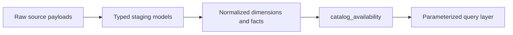

# WatchPulse Data Model

Status: implemented v0.3 warehouse contract with later-version extensions
identified where applicable. This document owns table grains, keys, field
semantics, and historical behavior.

## Modeling principles

- `tmdb_id` is the canonical shared external content identifier when available.
- Region and provider are mandatory dimensions of streaming availability.
- Stable WatchPulse provider keys isolate the product from upstream IDs.
- Raw, normalized, and serving data remain separate.
- Lifecycle events are append-only and outlive upstream history windows.
- New Releases and Recently Added use different dates and rules.
- Upcoming content is never treated as currently available.

## Layer overview



## Raw layer

Raw Parquet files preserve source responses close to verbatim. Common envelope
fields are:

| Field | Type | Meaning |
|---|---|---|
| `fetched_at` | timestamp with timezone | When WatchPulse received the response |
| `request_params` | JSON string | Non-secret request context |
| `payload` | JSON string | Near-verbatim source response |

Partitions include source, endpoint, entity type, country, and ingestion date.
Raw batches are immutable; retries may produce duplicate observations that are
deduplicated downstream.

## Normalized models

### `dim_content`

Grain: one row per `tmdb_id` and `content_type`.

| Field | Type | Rules |
|---|---|---|
| `tmdb_id` | bigint | Not null; part of primary key |
| `content_type` | text | `movie` or `tv`; part of primary key |
| `title` | text | Display title; not null |
| `original_title` | text | Original movie/show name |
| `overview` | text | Nullable |
| `release_date` | date | Movie release or TV first-air date |
| `release_year` | integer | Derived from the full date or supplied by a fallback source |
| `runtime_minutes` | integer | Nullable; positive when present |
| `original_language` | text | ISO-style language code when supplied |
| `tmdb_rating` | decimal | Nullable; between 0 and 10 |
| `vote_count` | integer | Non-negative |
| `tmdb_popularity` | decimal | Nullable; non-negative |
| `poster_path` | text | Nullable TMDB image path |
| `backdrop_path` | text | Nullable TMDB image path |
| `metadata_source` | text | TMDB preferred; lifecycle metadata fallback |
| `metadata_source` | text | Selected source; TMDB is preferred |
| `source_updated_at` | timestamp | Latest known source update |
| `created_at` | timestamp | First normalized observation |
| `updated_at` | timestamp | Latest normalized observation |

Current descriptive values are stored here. Historical popularity and rating
measurements belong in `title_daily_metrics` if required.

### `content_genres`

Grain: one row per content and genre.

| Field | Type | Rules |
|---|---|---|
| `tmdb_id` | bigint | References `dim_content` |
| `content_type` | text | References `dim_content` |
| `genre_id` | integer | Source genre identifier |
| `genre_name` | text | Normalized display name |

Primary key: `tmdb_id`, `content_type`, `genre_id`. The v0.3 dbt model expands
TMDB genre arrays and requires every retained identifier to map to the
version-controlled genre reference seed.

The seed is intentionally temporary. The planned replacement is:

```text
TMDB genre definitions
    -> scheduled ingestion
    -> immutable raw genre Parquet
    -> stg_tmdb_genres
    -> dim_genre
    -> content_genres
```

The future `dim_genre` will track first/last observation and name changes. New
combinations of already-known genres need no special handling today; only an
unknown content-type/genre-ID pair fails the strict mapping test and preserves
the previous published database. See ADR-015.

### `dim_provider`

Grain: one row per stable WatchPulse provider.

| Field | Type | Rules |
|---|---|---|
| `provider_key` | text | Primary key, for example `netflix` |
| `provider_name` | text | User-facing name |
| `is_active` | boolean | Whether WatchPulse currently supports it |

The frontend and API use `provider_key`, never an upstream provider ID.

### `provider_source_map`

Grain: one row per provider, source, and optional region-specific mapping.

| Field | Type | Rules |
|---|---|---|
| `provider_key` | text | References `dim_provider` |
| `source` | text | Such as `tmdb` or `streaming_availability` |
| `source_provider_id` | text | Upstream identifier stored as text |
| `region` | text | Nullable ISO alpha-2 code if mapping varies by market |

Primary key: `provider_key`, `source`, `source_provider_id`, `region` with a
documented null-safe implementation in dbt.

The v0.3 crosswalk contains the four launch providers for both TMDB and
Streaming Availability in Greece. Adding a region or source requires explicit
seed rows and relationship tests rather than application-facing ID changes.

### `streaming_availability`

Grain: one row per content, region, provider, and monetization type.

| Field | Type | Rules |
|---|---|---|
| `tmdb_id` | bigint | References `dim_content` |
| `content_type` | text | `movie` or `tv` |
| `region` | text | ISO alpha-2; not null |
| `provider_key` | text | References `dim_provider`; not null |
| `monetization_type` | text | Subscription, free, ads, rent, or buy |
| `available_since` | timestamp/date | When current availability began |
| `available_from` | timestamp/date | Future arrival time for upcoming rows |
| `expires_on` | timestamp/date | Nullable expected removal time |
| `is_available` | boolean | True only for current availability |
| `is_upcoming` | boolean | True only for announced future availability |
| `source` | text | Lifecycle source |
| `source_updated_at` | timestamp | Upstream update time when supplied |
| `last_updated_at` | timestamp | Latest WatchPulse observation |

Primary key: `tmdb_id`, `content_type`, `region`, `provider_key`,
`monetization_type`.

Required invariant: `is_available` and `is_upcoming` cannot both be true.

### `streaming_events`

Grain: one distinct lifecycle event reported or derived by WatchPulse.

| Field | Type | Rules |
|---|---|---|
| `event_id` | text/UUID | Primary key; deterministic when possible |
| `tmdb_id` | bigint | References content |
| `content_type` | text | `movie` or `tv` |
| `region` | text | ISO alpha-2; not null |
| `provider_key` | text | References provider; not null |
| `monetization_type` | text | Nullable if upstream event lacks it |
| `event_type` | text | `new`, `removed`, `updated`, `expiring`, `upcoming` |
| `event_date` | timestamp/date | Effective lifecycle time |
| `available_from` | timestamp/date | Nullable announced arrival |
| `expires_on` | timestamp/date | Nullable announced expiration |
| `source` | text | Originating source |
| `source_event_id` | text | Nullable upstream identity |
| `ingested_at` | timestamp | WatchPulse receipt time |

Update strategy: append-only with deterministic deduplication. Current upstream
state never deletes old events.

The normalized contract is persisted as append-only Parquet under
`data/lake/events`, partitioned by source, region, and ingestion date. dbt
deduplicates these observations without discarding raw history.

### `title_daily_metrics`

Grain: one row per content and observation date.

Fields include TMDB popularity, rating, vote count, and their derived changes.
This model is optional until ranking requires historical momentum.

### `pipeline_runs`

Grain: one row per source/job execution.

| Field | Type |
|---|---|
| `run_id` | text/UUID |
| `job_name` | text |
| `source` | text |
| `started_at` | timestamp |
| `finished_at` | timestamp |
| `status` | text |
| `api_request_count` | integer |
| `rows_fetched` | integer |
| `rows_inserted` | integer |
| `rows_updated` | integer |
| `rows_failed` | integer |
| `error_message` | text, sanitized |

Update strategy: insert at start, update the same row at completion/failure.
Run records are retained for operational history.

## Serving model

### `catalog_availability`

Grain: one content, region, provider, and monetization type serving row.

It denormalizes fields needed by filters and title cards:

```text
tmdb_id, content_type, title, overview, release_date, release_year, runtime_minutes,
original_language, genres, tmdb_rating, vote_count, popularity_score,
region, provider_key, provider_name, monetization_type, available_since,
available_from, expires_on, is_available, is_upcoming, poster_path,
backdrop_path, metadata_source, availability_source, last_updated_at
```

The implemented dbt mart contains current and upcoming availability. TMDB is
the preferred metadata source; embedded lifecycle metadata is an explicit
fallback for upcoming titles not yet discovered by TMDB. Source ratings and
temporary signed image URLs are not mapped into TMDB fields. The frontend never
receives raw payload structures.

### `catalog_freshness`

Grain: one row for the published `catalog_availability` dataset.

It records the warehouse build timestamp, latest contributing source timestamp,
and total/current/upcoming row counts. The publisher checks these values against
the physical catalog before making a candidate database live.

## Discovery semantics

All sections start from the same region, provider, content type, genre, runtime,
release year, rating, and language filters.

The v0.4 API represents this universe with one immutable `DiscoveryFilters`
contract. Region and at least one provider are required. Content type, genre
IDs, maximum runtime, inclusive release-year bounds, minimum TMDB rating, and
original language are optional. Validation and normalization happen before the
repository receives the values; unknown query fields are rejected.

The query engine combines different filter categories with `AND`. Multiple
providers and multiple genre IDs each use `OR` within their own category. The
serving mart's provider-level rows are grouped into one content result with a
list of matching provider/monetization availability records, so the frontend
does not deduplicate title cards.

| Section | Required predicate | Date used |
|---|---|---|
| Top 10 | `is_available = true` | none |
| New Releases | currently available and recent release | `release_date` |
| Recently Added | currently available and recently added | `available_since` |
| Leaving Soon | currently available and near expiration | `expires_on` |
| Upcoming | future arrival and not currently available | `available_from` |

## Required data tests

- primary keys are unique and non-null;
- all region values are valid configured ISO alpha-2 codes;
- provider and content relationships are valid;
- ratings, vote counts, and runtimes remain in valid ranges;
- upcoming rows are not currently available;
- removed events close current availability;
- events are not deleted by later source snapshots;
- New Release and Recently Added rules use their respective dates;
- no discovery query leaks rows across region or provider boundaries.
